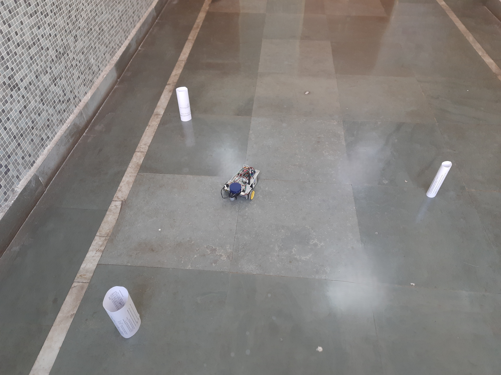
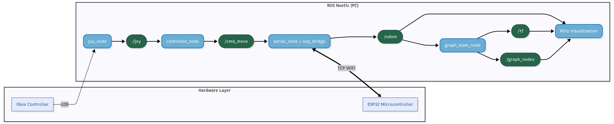

# Distributed ESP32-ROS Architecture for Graph SLAM for Mobile Robot

---

## 1. Overview
This repository implements a **Graph-based SLAM (Simultaneous Localization and Mapping)** system designed for low-cost mobile robots. The architecture is distributed: low-level motor control and odometry integration are handled by an **ESP32** microcontroller, while high-level SLAM processing and visualization run on a host PC using **ROS Noetic**.

The system features a robust teleoperation suite that interfaces an **Xbox controller** with the robot's string-based command protocol, utilizing dead-zone filtering and state-machine logic to ensure smooth control.

---

## 2. Results

<p float="left">
  
  
</p> 

---
## 3. System Architecture

The project is encapsulated within a modular node structure defined in `slam_system.launch`.

### ROS Interface
* **Subscribed Topics:**
    * `/joy` (`sensor_msgs/Joy`): Raw data from the Xbox controller driver.
    * `/cmd_move` (`std_msgs/String`): High-level text commands sent to the ESP32 (e.g., "forward").
* **Published Topics:**
    * `/odom` (`nav_msgs/Odometry`): Robot pose estimated from wheel encoders.
    * `/tf` (`tf2_msgs/TFMessage`): Transforms for `map` -> `odom` -> `base_link` -> `laser`.
    * `/graph_nodes` (`visualization_msgs/MarkerArray`): Visualizes the optimized trajectory nodes in Rviz.

---

## 4. Features
* **Graph SLAM Backend:** Replaces traditional EKF filtering with a pose-graph optimization approach, treating robot poses as nodes and odometry/sensor measurements as edges (constraints).
* **Distributed Processing:**
    * **ESP32:** Handles real-time motor PWM, encoder tick counting, and kinematic calculations.
    * **PC:** Handles joystick processing, LiDAR data, and graph optimization.
* **Robust Teleoperation:**
    * Includes a custom driver that converts continuous Xbox joystick axes into discrete command strings (`forward`, `left`, `stop`, etc.).
    * Implements **Dead-zone Thresholding** to prevent drift.
    * Implements **State-Machine Logic** to optimize bandwidth (prevents spamming duplicate commands).
* **Bridge Interface:** Uses `rosserial` over TCP/WiFi to bridge the ESP32 hardware with the ROS ecosystem transparently.

---


## 5. Core Algorithms

### 5.1. Graph SLAM (Pose Graph Optimization)
Unlike EKF SLAM which filters a state vector, this system constructs a graph:
1.  **Nodes ($x_t$):** represent the robot's pose at time $t$.
2.  **Edges ($z_{t}$):** represent constraints.
    * **Odometry Edges:** Constraints between sequential poses ($x_{t-1} \to x_t$) derived from wheel encoders.
    * **Observation Edges:** Constraints derived from LiDAR scan matching (Loop Closures).

The system solves a non-linear least squares problem to minimize the error across all constraints:
$$\hat{x} = \text{argmin}_x \sum_t || z_t - h(x_{t-1}, x_t) ||^2_{\Sigma}$$

### 5.2. Joystick-to-String Teleop
The robot firmware expects string commands (`"w"`, `"a"`, `"s"`, `"d"` equivalent). The `xbox_string_teleop` node acts as a translator:
1.  **Input:** Reads continuous float values (-1.0 to 1.0) from Xbox axes.
2.  **Thresholding:** Applies a logic gate where `axis_value > 0.5` triggers a command. Values below 0.5 are treated as noise (Stop).
3.  **Priority:** Vertical axes (Throttle) take priority over Horizontal axes (Steering) to prevent ambiguous movements.

---

## 6. Setup and Execution

### 6.1. Prerequisites
* **ROS Noetic** (Ubuntu 20.04)
* **Joy Package:**
    ```bash
    sudo apt-get install ros-noetic-joy
    ```
* **ESP32 Dependencies:**
    * PlatformIO or Arduino IDE with `rosserial_arduino` library.

### 6.2. Build Instructions
1.  Clone this repository into your workspace:
    ```bash
    cd ~/catkin_ws/src
    git clone [YOUR_REPOSITORY_URL]
    ```
2.  Build the packages:
    ```bash
    cd ~/catkin_ws
    catkin_make
    source devel/setup.bash
    ```

### 6.3. Hardware Connection
1.  Connect the ESP32 to the same WiFi network as your PC.
2.  Connect the Xbox Controller via Bluetooth or USB to the PC.
3.  Verify the joystick device:
    ```bash
    ls /dev/input/js*
    ```

### 6.4. Execution
Run the complete system (Drivers, Bridge, SLAM, and Rviz) using the master launch file:

```bash
roslaunch slam_system slam.launch
```
## 7. Tuning Parameters

### 7.1 Launch File (`slam.launch`)
These parameters control the physical odometry calculation and driver settings.

* **`wheel_base` (Default: 0.155):** The distance between the centers of the two drive wheels (in meters).
* **`ticks_per_meter` (Default: 191):** The number of encoder ticks generated per meter of travel.
    * *Formula:* (Ticks per Rev) / (Wheel Circumference).
* **`joy_node/dev`:** The hardware path to the controller (usually `/dev/input/js0` or `js1`).
* **`joy_node/autorepeat_rate`:** How often (Hz) the joystick republishes data even if nothing changes. High values make the "Stop" command register faster when connection is lost.

### 7.2 Python Script (`xbox_string_teleop.py`)
These constants are located inside the script and control the "feel" of the driving.

* **`TRIGGER_THRESHOLD` (Default: 0.5):** The sensitivity of the joystick.
    * *Lower (e.g., 0.1):* Robot moves with very slight touches.
    * *Higher (e.g., 0.8):* Requires pushing the stick almost all the way to move.
* **`AXIS_LEFT_STICK_X` / `_Y`:** Index mappings for the controller axes.
    * If using a non-Xbox controller (e.g., PS4, Logitech), run `rostopic echo /joy` to find the correct indices and update these variables in the script.
 
## 8. Future Work

* **Migration to micro-ROS:** Transitioning from `rosserial` to `micro_ros` (Agent/Client architecture) to enable native ROS 2 DDS communication over WiFi/UDP.
* **Loop Closure Detection:** Implementing Scan Context or ICP-based loop closure to correct drift in large loops (e.g., mining tunnels).
* **IMU Fusion:** Integrating an MPU6050 via an Extended Kalman Filter (`robot_localization` package) to fuse gyro data with wheel encoders for robust rotation estimation.
* **PWM Smoothing:** Currently, the robot receives binary commands (Move/Stop). Future firmware updates will parse float values from the joystick to enable proportional speed control (analog throttle).
